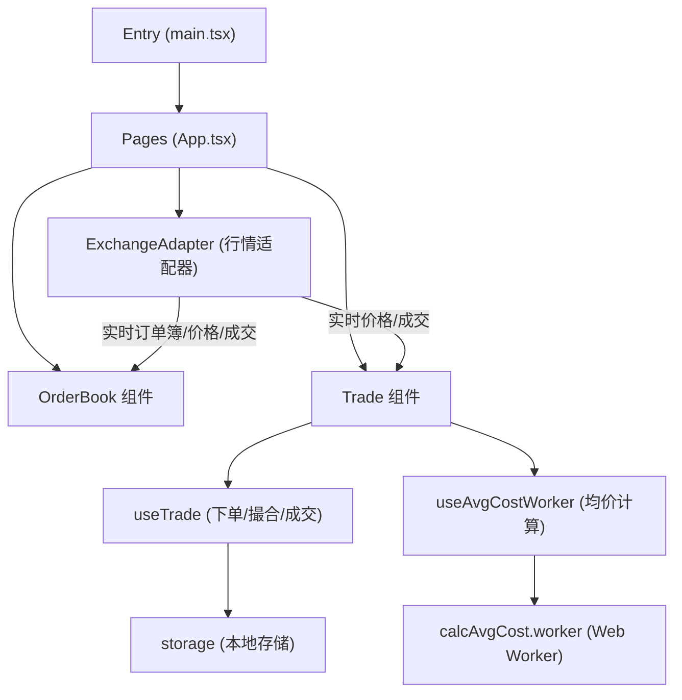

**Online Preview:** [https://ethanyanghit.github.io/mini-trader/](https://ethanyanghit.github.io/mini-trader/)

# 启动与构建说明

## 本地开发

```bash
npm install
npm run dev
```

## 生产构建

```bash
npm run build
```

## 本地预览生产构建

```bash
npm run preview
```

## 代码检查

```bash
npm run lint
```

## 代码格式化

```bash
npm run format
```

## 端到端（E2E）测试

本项目使用 [Playwright](https://playwright.dev/) 进行端到端自动化测试。

### 安装 Playwright 依赖

如首次运行或未安装 Playwright 依赖，请执行：

```bash
npx playwright install
```

### 运行测试

确保本地开发服务已启动（`npm run dev`），然后运行：

```bash
npx playwright test
```

### 测试覆盖场景
- 首页加载
- 买单挂单生成（自动填写下单表单并断言挂单表格出现买单）

测试用例位于 `test/basic.spec.ts`。

## Husky & lint-staged

本项目集成了 [Husky](https://typicode.github.io/husky/#/) 和 [lint-staged](https://github.com/okonet/lint-staged)：

- **Husky** 用于在 git commit 前自动触发代码检查和格式化。
- **lint-staged** 只会检查和格式化本次提交涉及的文件，提升效率。
- pre-commit 钩子会自动运行 `eslint --fix` 和 `prettier --write`，保证代码风格统一。

### 跳过 pre-commit 钩子
如需跳过钩子（不推荐），可在 commit 时加上 `--no-verify`：

```bash
git commit -m "your message" --no-verify
```

# 项目代码架构



- 入口 `main.tsx` 加载主页面 `App.tsx`
- `App.tsx` 组织页面结构，包含 `OrderBook`（订单簿）和 `Trade`（交易区）组件
- `ExchangeAdapter` 负责行情数据推送，分别将实时订单簿/价格/成交推送给 `OrderBook` 和 `Trade` 组件
- `Trade` 组件依赖 `useTrade`（下单/撮合/成交）和 `useAvgCostWorker`（均价计算）两个业务 hook
- `useTrade` 依赖本地存储，`useAvgCostWorker` 通过 Web Worker 计算均价

## 部署到 GitHub Pages

1. **配置 Vite base 路径**

   在 `vite.config.ts` 中添加：
   ```ts
   export default defineConfig({
     base: '/mini-trader/', // 仓库名，前后都要有斜杠
     plugins: [react()],
   })
   ```
   > 仓库名不是 mini-trader 时请相应修改。

2. **安装 gh-pages 依赖**
   ```bash
   npm install --save-dev gh-pages
   ```

3. **在 package.json 添加部署脚本**
   ```json
   "scripts": {
     "deploy": "npm run build && gh-pages -d dist"
   }
   ```

4. **构建并部署**
   ```bash
   npm run deploy
   ```

5. **GitHub Pages 设置**
   - 打开仓库 → Settings → Pages
   - 选择 Branch: gh-pages，目录为 /
   - 保存后访问：
     `https://<你的用户名>.github.io/mini-trader/`
